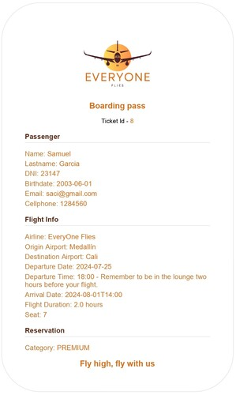
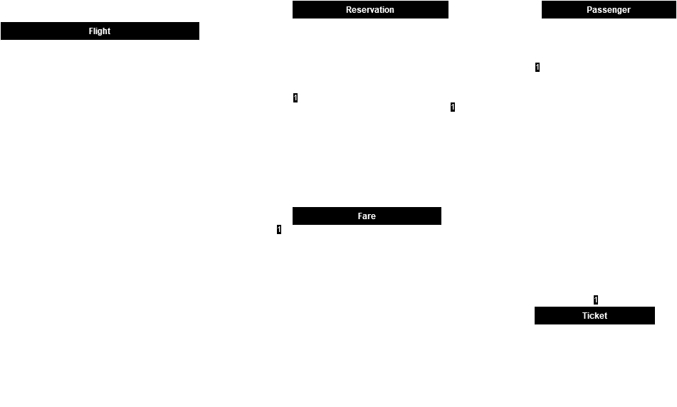
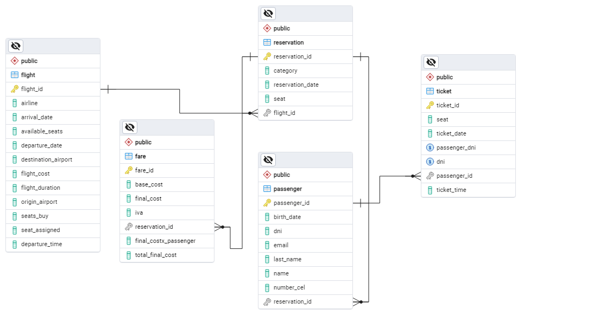
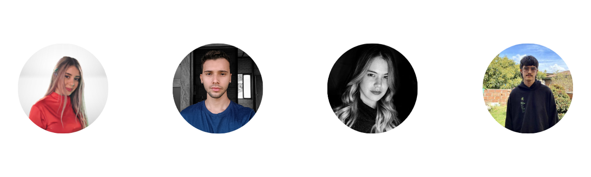

  <h1 align="center">
    EVERYONE FLIES
     
     
    Fly High, Fly With Us
     
     
      
  </h1>

**Everyone Flies** es un proyecto diseñado para aplicar los conocimientos adquiridos en el Bootcamp de desarrollo backend de BeTek. El objetivo principal es desarrollar un sistema de reservas de vuelos para la aerolínea del mismo nombre. A continuación, se detallan los lineamientos generales seguidos para alcanzar este propósito:

### Gestión de Vuelos
- **Creación, actualización, visualización y búsqueda de vuelos:** Los vuelos incluyen detalles completos como ID, aerolínea, aeropuertos, fechas, asientos y costos.

### Gestión de Reservas
- **Manejo de reservas:** Asociadas a vuelos y pasajeros, permitiendo la creación, actualización y visualización de las mismas.

### Gestión de Tickets y Proceso de Check-in
- **Generación de pases de abordar en formato PDF:** Para facilitar el proceso de check-in.
- **Visualización de tickets:** Permitiendo a los usuarios ver sus tickets.
- **Generación de tickets electrónicos:** ras la confirmación de la reserva, se envía el PDF del ticket y la información de la reserva por correo electrónico.

### Check-in
Para completar el proceso de check-in y obtener un pase de abordar en formato PDF, se realizan dos verificaciones clave:
1. **Verificación del DNI:** El DNI ingresado por el pasajero debe coincidir con el ID de la reservación proporcionada.
2. **Validación del Tiempo de Check-in:** El check-in debe realizarse entre 24 horas y 1 hora antes del vuelo programado.

      

## Sky Bot

Hemos implementado un bot llamado Sky utilizando Dialogflow de Google. Sky facilita la interacción con los usuarios mediante la automatización de las siguientes tareas:

- **Reservas de vuelos:** Los usuarios pueden realizar reservas de vuelos a través de una conversación natural con Sky.   Para hacer una reserva, el bot envia un mensaje solicitando tus datos con el siguiente formato:  "Por favor, ingresa los datos de la reserva en el siguiente formato: dni, nombre, apellido, email, fecha de nacimiento, número de celular, id del vuelo, categoría del asiento."

- **Consulta de vuelos disponibles:**  Sky proporciona información actualizada sobre los vuelos disponibles en el momento de la consulta.

---

### Diagrama UML

      

### Diagrama Entidad Relación

      

### Tecnologias utilizadas
- **Lenguajes de programación:** Java
- **Frameworks:** Spring Boot 
- **Bases de Datos:** PostgreSQL
- **Herramientas y Servicios:** Swagger, JUnit5, Insomnia, OpenPDF, Jakarta Mail, Google Cloud, Dialogflow

### Integración Continua y Despliegue
Implementamos integración continua con [GitHub Actions](https://docs.github.com/es/actions) para automatizar pruebas y compilaciones. El despliegue del microservicio se realizó en [Render](https://render.com/), facilitando un hosting y escalado eficientes.

## Contributors

## Expresiones de Gratitud

Nuestro equipo da las gracias al equipo de BeTek por su constante apoyo. Hicieron que esta experiencia no sólo estuviera llena de conocimientos para nuestro futuro profesional 📚, sino también llena de risas 😂, nuevos amigos 🤝 y compañía.

Damos también las gracias a nuestros compañeros. Ellos estuvieron ahí incontables veces cuando no entendíamos algo 🤔, nos dieron una voz de ánimo cuando estuvimos cansados y a veces, rendidos 💪.

Y por supuesto, a los familiares, parejas y amigos que de alguna u otra forma manifestaron su amor ❤️ para que lográramos llegar al final de este proceso 🏁.
